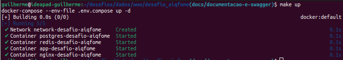
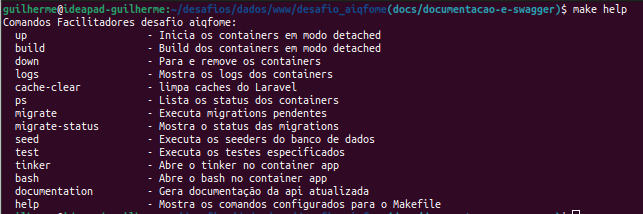
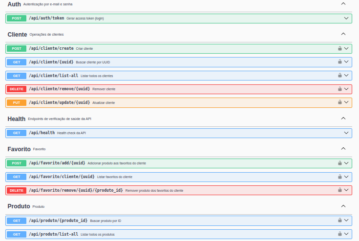
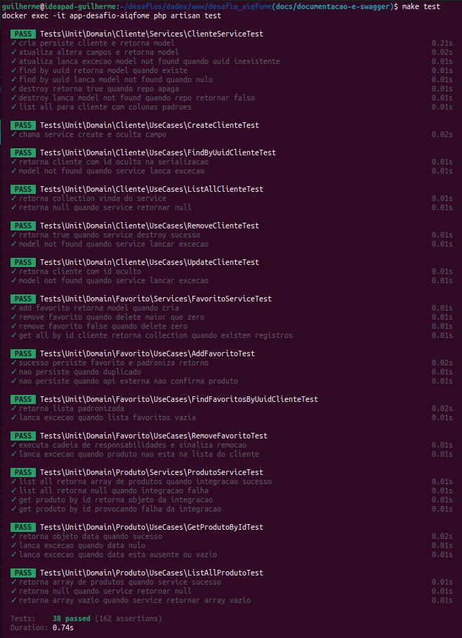

# Desafio Aiqfome
O aiqfome está expandindo seus canais de integração e precisa de uma API robusta para gerenciar os "produtos favoritos" de usuários na plataforma. Essa funcionalidade será usada por apps e interfaces web para armazenar e consultar produtos marcados como favoritos pelos clientes. A API terá alto volume de uso e integrará com outros sistemas internos e externos.

Linguagem e framework selecionados: 
- "laravel/framework": "^12.0",
- "php": "^8.2",
  
## Pré-requisitos
- SO: Linux, macOS ou WSL2 (Windows 11/10)
- Docker version 28.4.0
- Docker Compose version v2.22.0
- Make (GNU Make) ≥ 4.x (somente se for usar o Makefile)
  - Linux/Ubuntu: `sudo apt update && sudo apt install make`   
- Git (para clonar o projeto)
- Portas livre no host: 8080

## Como fazer o Build da aplicação

- Resultado Esperado  

### Opção 1) Com makefile configurado  (Recomendado)
Execute:
- `make inicializa-aplicacao`
  
O Makefile facilitará a execução de alguns comandos corriqueiros. Para visualizar o que configurei nele com aplicação UP execute:
- `make help`

### Opção 2) Docker & Docker Compose
Na raiz do projeto:
- `cd desafio_aiqfome`
  
`cp src/.env.example src/.env; 
docker compose --env-file .env.compose up -d --build; 
docker exec -it app-desafio-aiqfome composer install; 
docker exec -it app-desafio-aiqfome php artisan key:generate; 
docker exec -it app-desafio-aiqfome php artisan migrate; 
docker exec -it app-desafio-aiqfome php artisan db:seed; 
docker exec -it app-desafio-aiqfome php artisan l5-swagger:generate; 
docker exec -it app-desafio-aiqfome php artisan test;`

## Documentação
[Link do Swagger](http://localhost:8080/api/documentation)

## Customizações, Padrões e arquitetura
- Regras Validator Request
- Customização map de routes para modularização no config/app
- Aplicação do Middleware de validação da chave de API (ValidateApiKeyMiddleware)
- Chain of responsability (src/app/Domain/Favorito/UseCases/AddFavorito.php, src/app/Domain/Favorito/UseCases/RemoveFavorito.php, src/app/Domain/Favorito/UseCases/FindFavoritosByUuidCliente.php)
- Desacoplamento de Regras de negócio com arquitetura em camadas, Domain, UseCases, Services
- Repository Pattern
- Helpers (app/Helpers/helpers.php)
- Sanctum para autenticar os serviços
- Swagger 
### Estrutura de Banco
Table: users
- id
- nome
- email
- password
- timestamps

Table: integracao_servicos
- id
- nome
- sigla
- timestamps

Table: integracao_servicos_has_campos
- id
- integracao_servicos_id
- nome
- sigla
- valor
- timestamps

Table: cliente
- id
- uuid
- nome 
- e-mail (unique)
- avatar
- timestamps

Table: cliente_has_produtos_favoritos 
- cliente_id -> unique(['cliente_id', 'produto_externo_id'])
- produto_externo_id -> unique(['cliente_id', 'produto_externo_id'])
- timestamps
  
Obs: Os produtos sempre são buscados e validados via API. Desse modo não há nenhuma referência interna que não seja o id externo do produto

## Testes aplicados

## Coleção de dados do Postman
[Coleção de dados](src/storage/DESAFIO.postman_collection.json)

## Próximos passos 
- Aplicar o middleware user policy para controle da relação acesso token por serviço;
- Aumento da cobertura de testes;
- Agregar mais exceções específicas ao fluxo mais crítico dessa API (AddFavoritos);
- Aplicar Middleware de rate limit;